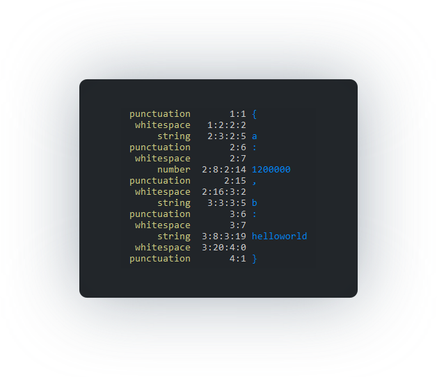

# `json-tokenize`

Splits a [`JSON`](http://jsonapi.org/) string into an annotated list of [tokens]().

**Screenshot**



## Installation

```sh
npm install --save json-tokenize
```

Or even better

```sh
yarn add json-tokenize
```

## Import and Usage Example

```js
const tokenize = require('json-tokenize')

const obj = {
  a: 12e5,
  b: -13,
  c: {
    d: true,
    e: null,
    f: 'a string'
  }
}

tokenize(JSON.stringify(obj))
```
